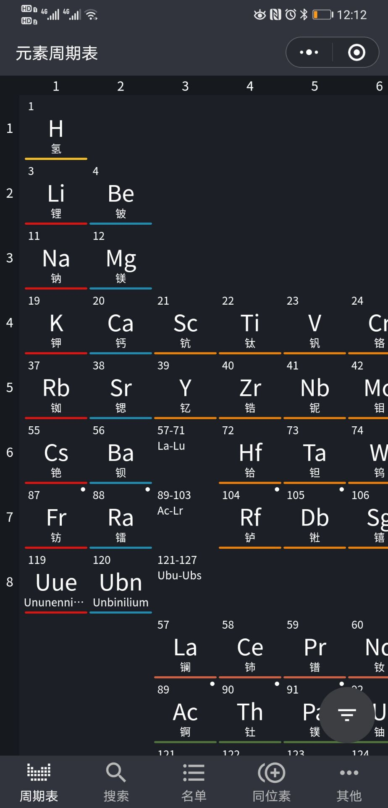
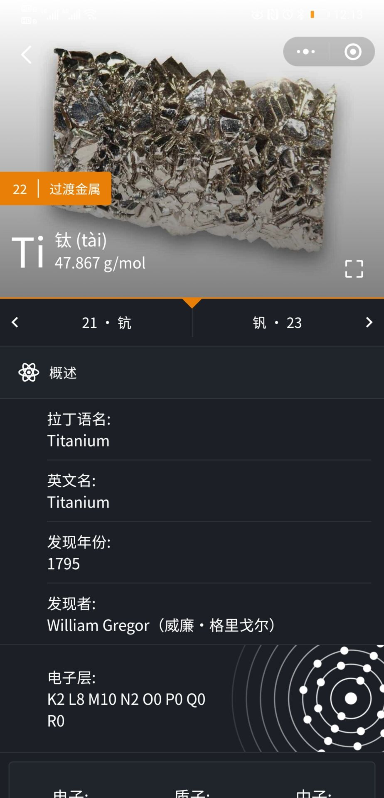
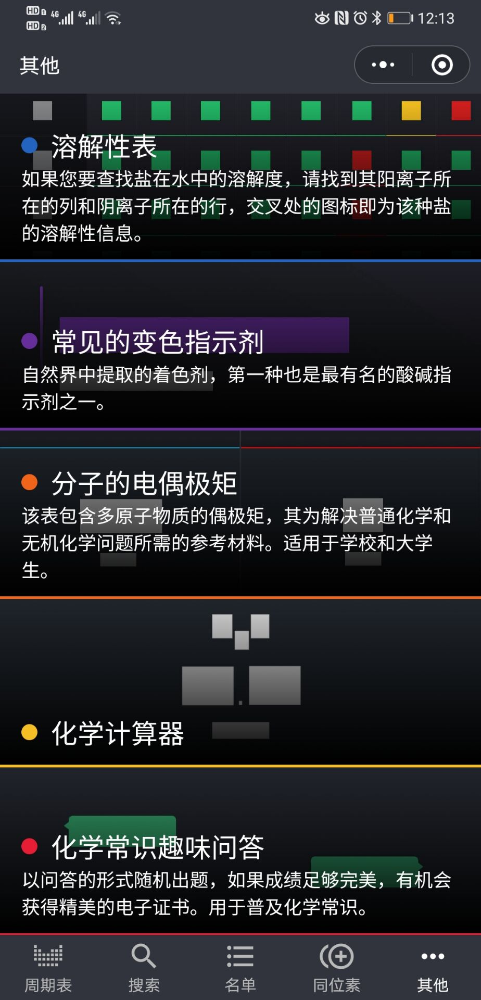

# 微信元素周期表: 专业版

微信小程序元素周期表已上线微信小程序几个月，自然用户 5k+

因精力有限难以维护项目，选择开源用于学习交流，为教育事业贡献个螺丝钉

## 捐赠
请我喝杯卡布奇诺？


## 本项目使用的优秀开源库
|  开源库   | 在本项目中的应用  |
|  ----  | ----  |
| [mini-program-iconfont-cli](https://github.com/iconfont-cli/mini-program-iconfont-cli)  | 从 iconfont 向微信小程序目录同步 svg 图标 |
| [exceljs](https://github.com/exceljs/exceljs)  | 发布前将 excel 预处理为小程序可读的 json 文件 |
| [html-entities](https://github.com/mdevils/html-entities)  | 将爬虫抓取的 html 字符串解释为肉眼字符串 |
| gulp / sass  | 构建工具 |

## 数据来源
项目中的数据来源于互联网、实体书籍以及 APP，不保证权威性和准确性，如有侵犯请邮件告知。

以下为数据来源
- iupac.org
- wiki.com
- periodicable.com
- Periodic Table Pro (Android APP)


## 小程序特征
- 国际纯粹与应用化学联合会 (IUPAC) 认可的长式周期表
- 126 个化学元素（含有至今发现的 118 个化学元素和 8 个理论元素）
- 每个元素都有基础信息，和热力学、原子、电磁、晶体、编号、反应活性、原子核、宇宙含量等性质
- 非常清晰的元素实体图片、电子分布图（动态生成）、光谱图、晶体图等
- 支持元素分类查询，属性过滤等功能
- 元素属性数据可视化，支持 19 种属性
- 所有元素的同位素信息
- 分子式计算器
- 变色指示剂工具
- 溶解性表以及溶解性信息
- 分子的电偶极矩
- 化学常识趣味问答（答题游戏）
- 元素的分享功能，支持分享给微信朋友

## 文件结构说明
仅做重要文件说明
- wxapp //小程序目录
    - app.js //小程序入口
    - script //构建工具脚本
    - packages //小程序分包目录
    - enums //枚举
    - database //数据
    - pages //视图
    - components //通用组件
    - behaviors //通用行为
    - assets //资源
- server //小程序 SEO 服务
- doc //文档目录
    - *.xlsx //项目源数据（执行 npm run database 会处理为 json 存放于小程序目录）


## 开发
使用本项目需安装 Node.js、微信开发者工具

进入小程序目录，执行 `npm install` 安装依赖

- 持续编译（此操作会将 scss 文件，持续编译成同名 wxss）
``` shell
npm run start
```

- 更新icon (更新iconfont组件)
``` shell
npm run icon
```

- 同步&处理数据文件到小程序
``` shell
npm run database
```

## 效果与演示
- 微信小程序线上版本


- 截图





## 从本项目得到的经验
1. 独立开发者更适合小而精的项目
2. 产品质量 ≠ 代码质量
3. 代码不重要，重要的是产品
4. 产品不重要，重要的是用户
5. **上线发布后不代表结项；相反，这只是开始**

## 联系我
Email: wilhan.tian@gmail.com

## 开源方式
```
MIT License

Copyright (c) 2020 WilhanTian  田伟汉

Permission is hereby granted, free of charge, to any person obtaining a copy
of this software and associated documentation files (the "Software"), to deal
in the Software without restriction, including without limitation the rights
to use, copy, modify, merge, publish, distribute, sublicense, and/or sell
copies of the Software, and to permit persons to whom the Software is
furnished to do so, subject to the following conditions:

The above copyright notice and this permission notice shall be included in all
copies or substantial portions of the Software.

THE SOFTWARE IS PROVIDED "AS IS", WITHOUT WARRANTY OF ANY KIND, EXPRESS OR
IMPLIED, INCLUDING BUT NOT LIMITED TO THE WARRANTIES OF MERCHANTABILITY,
FITNESS FOR A PARTICULAR PURPOSE AND NONINFRINGEMENT. IN NO EVENT SHALL THE
AUTHORS OR COPYRIGHT HOLDERS BE LIABLE FOR ANY CLAIM, DAMAGES OR OTHER
LIABILITY, WHETHER IN AN ACTION OF CONTRACT, TORT OR OTHERWISE, ARISING FROM,
OUT OF OR IN CONNECTION WITH THE SOFTWARE OR THE USE OR OTHER DEALINGS IN THE
SOFTWARE.
```